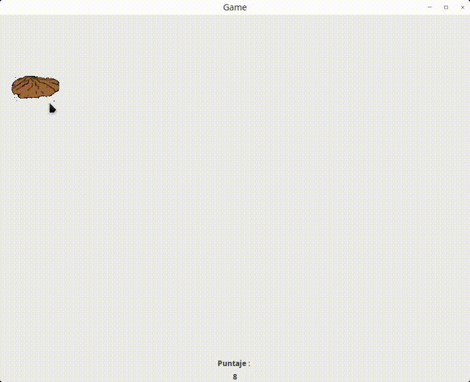

## Golpea al topo
funciona de la siguiente manera.  

una cuadrícula de Botones o JLabels de 7x7, en lo cual debe aparecer un topo (puede ser otro objeto o animal), cada 2 segundos, siendo que a su vez debe permanecer 2 segundos en el lugar correspondiente.  

- El jugador empezará con 5 puntos.
- Si el jugador llega a los 20 puntos, el juego debe indicar que se ha ganado.

- Si el juego llega a los 0 puntos, se deberá indicar que se ha perdido en el juego.

Por cada topo golpeado, se deberá incrementar un punto al jugador y por cada topo desaparecido sin que haya sido golpeado, se deberá descontar un punto (El golpe se considera cuando se le da click al topo).
Cuando el topo haya sido golpeado, dicho topo deberá desaparecer, aunque no haya pasado aún los 2 segundos de su estancia.  

